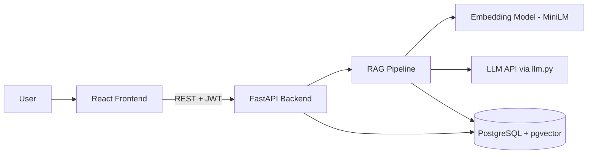

# RAG Document Assistant

Upload PDFs, ask questions, and get answers with source citations (page numbers).

> **Status:** work in progress. Step 1 (setup) is done, and Step 2 (RAG core) is next.

## Features (planned)

- Upload PDFs and ask questions about them
- Answers cite the source pages
- JWT login, so each user sees only their own documents
- Streamed answers, token by token
- Says "I don't know" when the PDF doesn't contain the answer

## Tech Stack

- **Frontend:** React
- **Backend:** FastAPI (Python)
- **Database:** PostgreSQL + pgvector (Neon)
- **Embeddings:** all-MiniLM-L6-v2 (sentence-transformers, 384 dimensions)
- **LLM:** Groq (`openai/gpt-oss-120b`)
- **PDF parsing:** PyMuPDF

## Architecture



## Setup

```powershell
git clone https://github.com/bhavesh0201/rag-document-assistant.git
cd rag-document-assistant/backend
py -m venv .venv
.venv\Scripts\Activate.ps1
pip install -r requirements.txt
copy .env.example .env
```

Then open `.env` and fill in your own `GROQ_API_KEY` and `DATABASE_URL`. Run `backend/scripts/init_db.sql` in your database to create the tables.

## Evaluation Results

Coming in Step 5 (retrieval accuracy on a 30-50 question test set).

## Demo

Coming in Step 7 (live link, screenshots, and demo video).