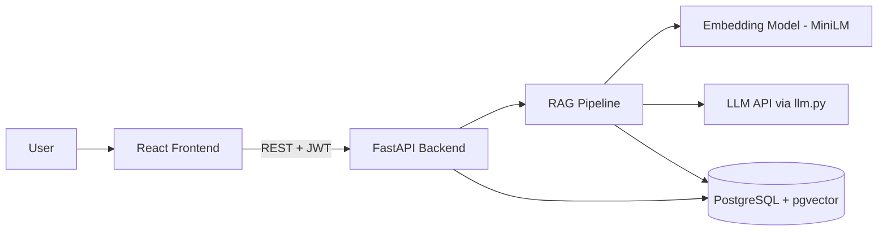

# Architecture: RAG Document Assistant

## Overview

Users upload PDFs, then ask questions about them. The system retrieves the most relevant chunks from the PDFs and passes them to an LLM, which answers with citations to the source pages.

## Components

| Component       | Technology                                                                      | Responsibility                                                    |
| --------------- | ------------------------------------------------------------------------------- | ----------------------------------------------------------------- |
| Frontend        | React                                                                           | Login, upload, chat UI, source citations panel, streamed answers  |
| Backend API     | FastAPI (Python)                                                                | Auth (JWT), file upload, ingestion, retrieval, calling the LLM    |
| RAG pipeline    | Plain Python (inside the backend); LangChain text splitter only                 | PDF parsing, chunking, embedding, retrieval, prompt building      |
| PDF parsing     | PyMuPDF                                                                         | Extracts text page by page                                        |
| Database        | PostgreSQL + pgvector                                                           | App data (users, documents, chats, messages) and chunk embeddings |
| Embedding model | all-MiniLM-L6-v2 (sentence-transformers), 384 dimensions, run locally           | Converts text chunks and questions into vectors                   |
| LLM API         | openai/gpt-oss-120b (Gemini Flash-Lite as backup), called only through `llm.py` | Generates the final answer from retrieved context                 |

## System Diagram

## Flow 1: Document Ingestion (upload)

1. User uploads a PDF from the frontend (`POST /upload`).
2. Backend checks the JWT and saves a row in `documents`.
3. PyMuPDF extracts the text, page by page.
4. Text is split into chunks (starting at about 800 characters with 100 overlap, kept as config values and tuned in Step 5).
5. Each chunk is converted to a 384-dimension embedding with all-MiniLM-L6-v2.
6. Chunks are saved in `chunks` with `document_id`, `content`, `page_number`, and `embedding`.

## Flow 2: Question Answering (ask)

1. User sends a question (`POST /ask`) for a chat and document.
2. Backend embeds the question with the same embedding model used for ingestion.
3. A similarity search on `chunks` returns the top-k closest chunks (starting at k = 5, cosine distance).
4. A prompt is built: instructions + retrieved chunks + the question.
5. The prompt goes to the LLM through `llm.py`, and the answer is streamed to the frontend.
6. If the retrieved context doesn't contain the answer, the LLM must say it doesn't know.
7. The question and answer are saved in `messages`, with the chunk ids in `sources`, and the frontend shows the cited pages.

## Retrieval Improvements (Step 5)

1. Compare chunk size, overlap, and top-k using the evaluation set.
2. Add hybrid search: combine PostgreSQL full-text search with vector search.
3. Optionally add a reranker if time allows.

## Data Model (summary)

- `users` → has many `documents` and `chats`
- `documents` → has many `chunks`
- `chats` → has many `messages`
- `messages.sources` stores the ids of the chunks used for that answer

Full SQL schema is in `plan.md`.

## Design Rules

- The same embedding model (all-MiniLM-L6-v2) must be used for ingestion and for questions.
- The `vector(N)` size in the database must match the embedding model's output (384).
- All LLM calls go through the single `llm.py` function so the provider can be swapped easily.
- Users can only access their own documents, chats, and messages (filter by `user_id`).
- Secrets (API keys, database URL) live in `.env`, never in the repo.
- Retrieval settings (chunk size, overlap, top-k) are config values so they can be compared in evaluation.

## Deployment

- Frontend: Vercel
- Backend: Render or Railway
- Database: Supabase or Neon (pgvector enabled)
- Note: the embedding model runs inside the backend, so check that the chosen host has enough memory for it.

## Open Decisions

- Final chunk size, overlap, and top-k
- Whether to add a reranker
